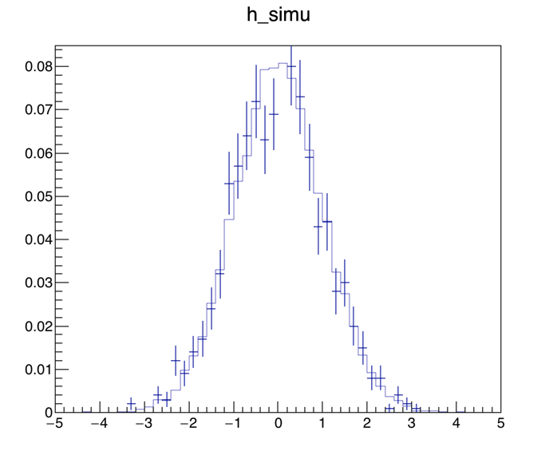
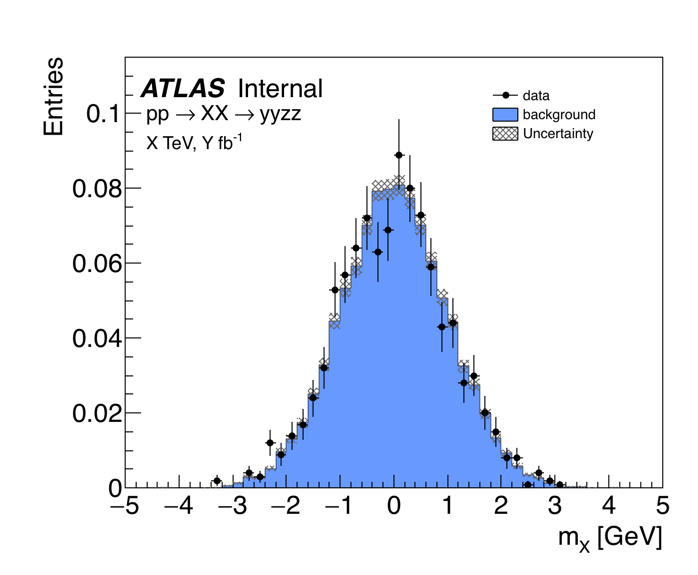

# CERN ROOT の使い方
C++かPythonのどちらかを使うことで、CERNが提供するお絵かきライブラリROOTを使用することができます。
高エネ実験でよく使用される実験データ・フォーマットはROOT形式だと思いますので、ROOTでの描画テクニックは至る所で必要になってくると思います。
ここでは必要最低限の描画テクニックをまとめて、たかがお絵かきに時間を掛けない研究ライフを送ることを目的とします。

## 見栄えを整える
見栄えを整える前（左）と、整えた後（右）。
ガウシアンで背景事象と実験値に見立てたデータを擬似的に生成、論文でよく見るような決めプロットみたいにするためのテクニックをまとめます。




### 統計Boxを消す

```
R.gStyle.SetOptStat(0)
```

### マージン（余白）を調整する

```
R.gPad.SetTopMargin(0.1);
R.gPad.SetBottomMargin(0.15);
R.gPad.SetRightMargin(0.05);
R.gPad.SetLeftMargin(0.18);
```

## 統計処理を加える

