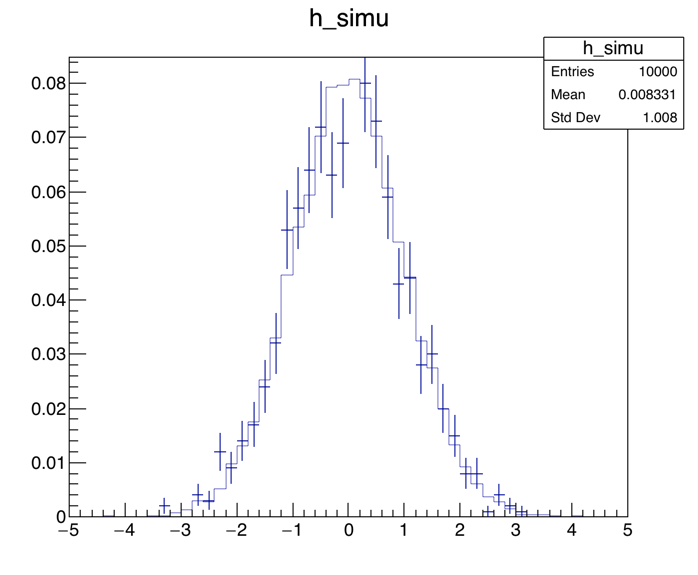

# CERN ROOT の使い方
C++かPythonのどちらかを使うことで、CERNが提供するお絵かきライブラリROOTを使用することができます。
高エネ実験でよく使用される実験データ・フォーマットはROOT形式だと思いますので、ROOTでの描画テクニックは至る所で必要になってくると思います。
ここでは必要最低限の描画テクニックをまとめて、たかがお絵かきに時間を掛けない研究ライフを送ることを目的とします。

## 見栄えを整える
見栄えを整える前（左）と、整えた後（右）。
ガウシアンで背景事象と実験値に見立てたデータを擬似的に生成、論文でよく見るような決めプロットみたいにするためのテクニックをまとめます。




何かと便利なので普段はPyROOTを使っています（解析は実行速度が欲しいのでC++で行って、描画はPythonでという形）。
なので以下に出てくる例は全てPythonスクリプトによるもので、

```python
import ROOT as R
```

を設定していることを前提としています。

### 統計Boxを消す

```python
R.gStyle.SetOptStat(0)
```

### マージン（余白）を調整する

```python
R.gPad.SetTopMargin(0.1);
R.gPad.SetBottomMargin(0.15);
R.gPad.SetRightMargin(0.05);
R.gPad.SetLeftMargin(0.18);
```

### x軸、y軸のタイトルを調整する

```python
h_simu.SetTitle("")
h_simu.GetXaxis().SetTitle("m_{X} [GeV]")
h_simu.GetXaxis().SetTitleSize(0.05)
h_simu.GetXaxis().SetTitleOffset(1.1)

h_simu.GetYaxis().SetTitle("Entries")
h_simu.GetYaxis().SetTitleSize(0.05)
h_simu.GetYaxis().SetTitleOffset(1.3)
```

### x軸、y軸のラベルを調整する

```python
h_simu.GetXaxis().SetLabelSize(0.05)
h_simu.GetYaxis().SetLabelSize(0.05)

```

### ヒストグラムの見栄え

```python
h_simu.SetLineColor(R.kBlack)
h_simu.SetFillColor(R.kAzure-4)
```

### エラーをメッシュで表示する

```python
h_error = h_simu.Clone()
h_error.SetFillStyle(3244)
h_error.SetFillColor(R.kGray+2)
h_error.SetMarkerStyle(8)
h_error.SetMarkerSize(0)
h_error.Draw("e2 same")
```

### 実験値をポイントで書く

```python
h_data.SetLineColor(R.kBlack)
h_data.SetMarkerStyle(8)
h_data.SetMarkerSize(0.8)
h_data.Draw("same p")
```

### ATLASラベルを書く（TLatex）
（思いっきり実験名出していますが...）
ROOTでは通常の汎用を書くためのTLegendクラスと、文字や数式を書くためのTLatexクラスが用意されています。
そして微妙に使い方が異なります。

```python
latex = R.TLatex()
latex.SetNDC(1)
latex.SetTextFont(72)
latex.DrawLatex(0.2, 0.83, "ATLAS")
latex.SetTextFont(42)
latex.DrawLatex(0.34, 0.83 , "Internal")
latex.SetTextSize(0.04)
latex.DrawLatex(0.21, 0.79, "pp #rightarrow XX #rightarrow yyzz")
latex.SetTextSize(0.035)
latex.DrawLatex(0.21, 0.74 , "X TeV, Y fb^{-1}")
```

### レジェンドを書く（TLegend）

```python
legend = R.TLegend(0.7, 0.75, 0.9, 0.85)
legend.SetBorderSize(0)
legend.SetFillStyle(0)
legend.AddEntry(h_data,  "data", "pl")
legend.AddEntry(h_simu,  "background", "f")
legend.AddEntry(h_error, "Uncertainty", "f")
legend.Draw()
```


## 統計処理を加える

