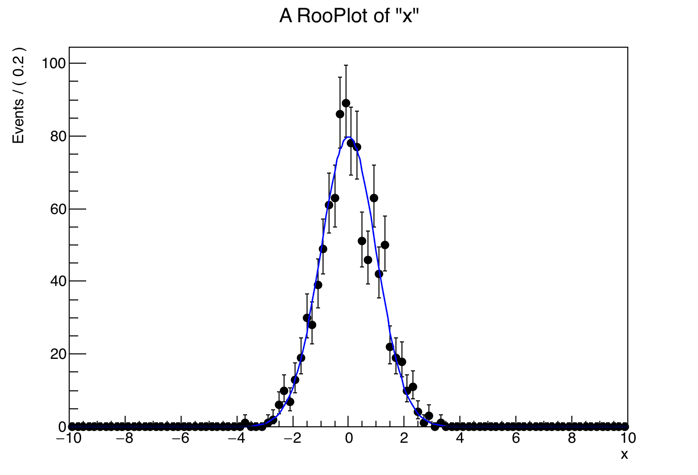

# RooStats, RooFit
CERN ROOTに付随する、より高度な統計処理を行うためのRooStats, RooFitと呼ばれるパッケージについての説明です。
個人的にヒストグラムを手軽に描画するときにはPyROOTを使っていますが、RooStats系を使うときにはC++を使っています（型、名前空間、引数の渡し方を明示したいので）。

## RooWorkspaceの基本のキ
ガウス分布に従った乱数を振って、描画する方法です。
RooWorkspaceにはfactoryメソッドと呼ばれる、便利な関数が用意されているのでそれを使いましょう。



```cpp
void gaussian()
{
    // RooWorkspaceの作成、名前を"ws"としている
    RooWorkspace ws("ws");

    // factoryメソッドを使って、一気に"MyGauss"という名前のガウス分布を定義している
    ws.factory("Gaussian::MyGauss(x[-10,10], mean[0], sigma[1])");
    
    // 乱数の生成
    RooDataSet* data = ws.pdf("MyGauss")->generate(*ws.var("x"), 1000);

    // ヒストグラムの作成
    // 乱数によるデータ点と、ガウス分布の理論線を描画しています
    RooPlot *frame   = ws.var("x")->frame();
    data             ->plotOn(frame);
    ws.pdf("MyGauss")->plotOn(frame);
    frame->Draw();
}
```

ちなみにfactoryメソッドを使わなければ、以下のようにRooRealVarを変数分定義しなければならないのでより煩雑になる。

```cppp
void gaussian()
{
    RooRealVar  x("x","x",-10,10);
    RooRealVar  mean("mean","mean",0);
    RooRealVar  sigma("sigma","sigma",1);
    RooGaussian MyGauss("MyGauss","MyGauss",x,mean,sigma);

    RooDataSet* data = MyGauss.generate(x, 1000);
    RooPlot* frame = x.frame();
    data->plotOn(frame);
    frame->Draw();
}
```

## RooWorkspaceの使い方
